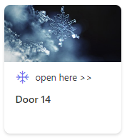
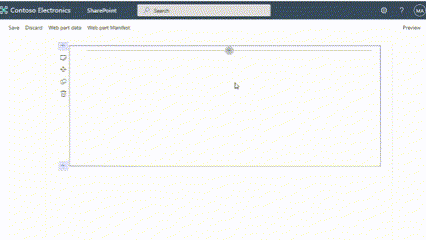

# Advent Calendar sample ACE
 Adaptive Card Extension for Viva Connections

## Summary

This sample demonstrates usage of SharePoint Framework to build an ACE that acts as implementation of Advent Calendar.

## Highlights

The card is pulling data from SharePoint list populated with 24 links and can be activated from 1.12 until 24.12 during so-called "Advent" period. Every day user is presented with different card which is linked with different page on the intranet or internet. When user clicks the card, linked webpage will open in browser.

## Demo

## Used SharePoint Framework Version

## Applies to

- [SharePoint Framework](https://aka.ms/spfx)
- [Microsoft 365 tenant](https://docs.microsoft.com/en-us/sharepoint/dev/spfx/set-up-your-developer-tenant)

> Get your own free development tenant by subscribing to [Microsoft 365 developer program](http://aka.ms/o365devprogram)

## Prerequisites

**SharePoint list**

List "AdventCalendar" based on Custom List template should be created on SharePoint Home site. The list should contain 24 items for 24 different "Doors" on the calendar.

Field "Title" in the list should be re-configured as "Not Required".

In addition to default list fields, list should be extended with 3 additional fields to store:
- image for the Advent Calendar entry
- link to the webpage/SharePoint page which users will visit by clicking on calendar card, and
- ordering sequence, from 1 to 24 

Configuration for 3 fields mentioned above:

Display Name|Internal Name|Type|Required|Additional settings
------------|-------------|----|--------|--------
Link|Link|Hyperlink or Picture|N|Format URL as Hyperlink
Picture|Picture|Image|N|
Sequence|Sequence|Number|N|Enforce Unique Values: Yes; Min: 1; Max: 24; Decimal Places: 0

## Configuration

To configure the Advent Calendar card on the Viva Connections dashboard:

1. Select the `Advent Calendar` card on the Viva Connections dashboard to add.
  

## Property Pane Configuration

The card has below custom properties:

Property|Type|Required|Comments
--------|----|--------|--------
Card title|string|Y|Title of the card in dashboard
Enter list title|string|Y|Default value is AdventCalendar.
Door prefix text|string|Y|Prefix text that will be shown before actual sequence number on the card.
Open here text|string|Y|Provides a way to customize text calling user to open the card.

## Solution

| Solution    | Author(s)                                               |
| ----------- | ------------------------------------------------------- |
| spfx-advent-calendar-ace | Dragan Panjkov, Microsoft (https://github.com/panjkov) |

## Version history

| Version | Date             | Comments        |
| ------- | ---------------- | --------------- |
| 1.0     | November 2022 | Initial release |

## Disclaimer

**THIS CODE IS PROVIDED _AS IS_ WITHOUT WARRANTY OF ANY KIND, EITHER EXPRESS OR IMPLIED, INCLUDING ANY IMPLIED WARRANTIES OF FITNESS FOR A PARTICULAR PURPOSE, MERCHANTABILITY, OR NON-INFRINGEMENT.**

---

## Minimal Path to Awesome

- Clone this repository
- Ensure that you are at the solution folder
- in the command-line run:
  - `npm install`
  - `gulp serve`
 
### Package the app

To package the Adaptive Card Extension into an app using Gulp:

1. Go to the terminal where the working directory is the root folder of the project
2. To build the solution in release mode, run the `gulp bundle --ship` command
3. To make a release mode package of the solution, run the `gulp package-solution --ship` command
4. The package-solution task created an app package file named `spfx-advent-calendar-ace.sppkg` in the `./sharepoint/solution` folder. This file is your app package. Next, you'll deploy this package into the SharePoint app catalog, which contains all Viva Connections extensions.

### Create an app catalog

If you don't have an app catalog in your tenant, you'll need to create it before you continue this exercise.

1. In a web browser, go to the Microsoft 365 admin center located at https://admin.microsoft.com.
1. From the side menu, select the **Show all** option
1. From the list of Admin centers, select **SharePoint**
1. In the SharePoint admin center, from the side navigation, select **More features**
1. From the **Apps** section, select the **Open** button to go to the Apps admin page.
1. Under Apps, select **App Catalog**
1. If the site opens up, you already have an app catalog and you can skip further steps
1. If the app catalog doesn't exist, you'll be prompted to create one.
1. From the list of options, choose **Automatically create a new app catalog site** and select **OK**.
1. Deploy the app to SharePoint app catalog

### To deploy your application to the app catalog:

1. In a web browser, go to the SharePoint app catalog
1. In the SharePoint app catalog, from the side navigation choose **Apps for SharePoint**
1. Upload/drag and drop the **spfx-company-announcements-ace.sppkg** file into the list
1. SharePoint will ask you to confirm and deploy the package. It makes the package available to be installed in SharePoint sites.
1. Select **Deploy**

### Install the app in your Home site

Once the app is successfully deployed in the app catalog, you'll need to install it on your Home site.

To install the app:

1. In a web browser, go to the **Home** site
1. From the top navigation, select the **Settings (gear)** icon
1. From the SharePoint section, select the **Add an app** link. You'll be taken to the **My Apps** page
1. In the search box on the page, type **Advent** and locate the **Advent Calendar** app
1. To install the app, select the **Add** button

The Adaptive Card Extension in the app will now be available to add to the dashboard.

## References

- [Build your first SharePoint Adaptive Card Extension](https://learn.microsoft.com/en-us/sharepoint/dev/spfx/viva/get-started/build-first-sharepoint-adaptive-card-extension)
- [Deploy card to Viva Connections dashboard](https://learn.microsoft.com/en-us/sharepoint/dev/spfx/viva/get-started/adaptive-card-extensions-and-teams#viva-connections-dashboard)
- [Excercise - Deploy the Adaptive Card Extension to Viva Connections](https://learn.microsoft.com/en-us/training/modules/viva-connections-extend-with-adaptive-card-extensions/4-exercise-extend-viva-connections-with-adaptive-card-extensions)
